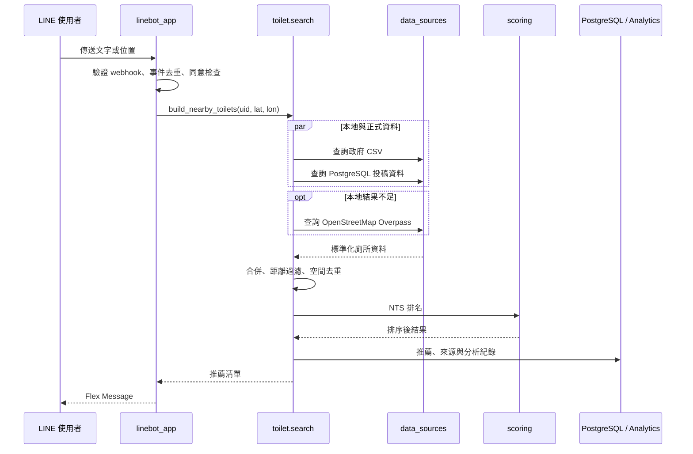
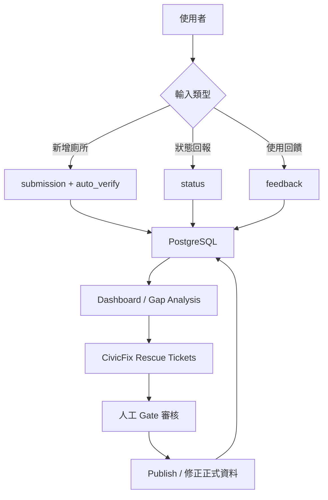

# 系統架構與資料流

這份文件說明 Toilet Bot 的元件邊界，以及一次查詢如何穿過系統。`app.py` 是 composition root：它建立 Flask app、注入跨模組依賴、初始化儲存層，最後註冊所有路由；主要商業邏輯放在各功能套件中。

## 1. 使用者搜尋流程



### 搜尋階段的責任

1. `linebot_app/handlers.py` 接收 LINE 事件，不負責決定資料來源。
2. `toilet/search.py` 編排搜尋、快取、fallback、合併與排序。
3. `toilet/data_sources.py` 封裝 CSV、PostgreSQL、Overpass 的查詢差異。
4. `toilet/scoring.py` 計算正式 NTS；`basic_ranking.py` 保留較單純的排序方式。
5. `linebot_app/replies.py` 與 handler 將結果組成 LINE 訊息。

## 2. 回饋與資料改善流程



- 投稿先經 `auto_verify.py` 檢查座標、文字品質、重複性與空間背景。
- 回饋與狀態資料會影響管理資訊及部分推薦訊號。
- `dashboard/` 將事件轉成使用趨勢、服務缺口與來源品質指標。
- `civicfix/` 將資料問題轉為可追蹤工單，再經人工審核發布。

## 3. 儲存層

| 儲存來源 | 用途 | 主要模組 |
| --- | --- | --- |
| PostgreSQL | 投稿、回饋、狀態、收藏、分析、推薦紀錄、CivicFix 與跨 worker 去重 | `core/database.py` |
| SQLite | 本機查詢快取、語言設定、搜尋與分析輔助資料 | `core/database.py` |
| CSV | 基礎公共廁所資料 | `data/public_toilets.csv`、`toilet/data_sources.py` |
| PKL 模型 | 清潔度分類與標籤編碼 | `models/`、`toilet/cleanliness.py` |
| JSON | 中英文介面文字 | `lang/`、`core/i18n.py` |

PostgreSQL 是多 worker 間需要共享狀態時的正式來源；記憶體與 SQLite 快取不能取代跨 instance 的一致性。

## 4. 套件邊界

| 套件 | 責任 | 不應負責 |
| --- | --- | --- |
| `core` | 基礎設施與通用工具 | 廁所排名或 LINE 對話規則 |
| `linebot_app` | LINE transport、對話分派與回覆 | 直接實作資料來源查詢 |
| `toilet` | 廁所領域邏輯與使用者資料 | 管理儀表板呈現 |
| `dashboard` | 分析聚合與視覺化 API | 修改正式廁所資料 |
| `admin` | 人工審核與管理操作 | 一般使用者聊天流程 |
| `civicfix` | 資料同步、問題救援、審核與發布 | LINE webhook transport |
| `features` | 跨領域的成就、徽章與 AI 使用功能 | 基礎資料庫連線管理 |

## 5. 可靠性與安全邊界

- LINE webhook 先驗證簽章，再交由 handler 處理。
- `webhookEventId` 與 reply token 使用 PostgreSQL 原子 claim，避免 Gunicorn workers 重複回覆。
- reply token 不做 push fallback，避免非預期主動訊息與重複通知。
- 外部資料查詢設有 timeout；OpenStreetMap 只在主要資料不足時 fallback。
- 管理與 CivicFix 操作使用 token／cookie 驗證。
- `.env`、服務帳號、SQLite runtime DB 與 Python cache 均不應進入版本控制。

## 6. 部署啟動順序

```text
Gunicorn 載入 app.py
  → 載入環境變數與設定
  → configure_* 注入跨模組依賴
  → 建立 Flask app 與安全 headers
  → 初始化 SQLite，背景初始化 PostgreSQL schema
  → register_*_routes 註冊功能入口
  → 接受 HTTP / LINE webhook 請求
```

這種安排讓 `app.py` 保持為組裝層；閱讀特定功能時，可以直接從對應套件進入，而不必在入口檔尋找所有實作。
