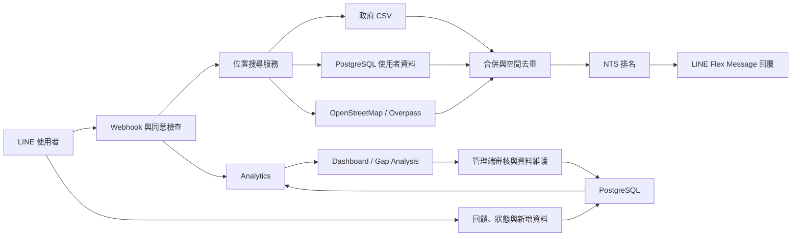

# Toilet Bot：智慧公共廁所搜尋與資料維護平台

Toilet Bot 是一套以 LINE Bot 為主要入口的公共廁所服務。使用者傳送目前位置後，系統會整合政府開放資料、使用者新增資料與 OpenStreetMap，經過距離、可信度、資訊完整度及即時狀態評分，回傳附近較適合的廁所。

除了搜尋功能，本專案也包含使用者回饋、狀態回報、使用分析、服務缺口分析，以及供管理者審核投稿的資料維護介面。

## 專案目標

- 降低使用者在陌生地點尋找公共廁所的時間。
- 不只依距離排序，也考慮資料可信度、資訊完整度及目前狀態。
- 讓使用者補充廁所、回報狀態並提供清潔度回饋。
- 將使用紀錄轉為服務缺口與資料維護依據。
- 建立從「搜尋」到「發現問題、審核、修正資料」的完整循環。

## 核心功能

| 使用者／角色 | 功能 |
| --- | --- |
| LINE 使用者 | 傳送位置、搜尋附近廁所、切換一般或 AI 推薦模式、收藏地點 |
| 一般使用者 | 新增廁所、回報設施狀態、填寫清潔度與使用回饋 |
| 系統 | 整合多個資料來源、去除重複地點、計算 NTS 排名、記錄推薦與操作事件 |
| 研究／管理者 | 查看使用儀表板、缺口分析、來源品質與排名行為指標 |
| 資料維護者 | 審核使用者投稿、重新驗證資料並查看維護摘要 |

## 系統運作方式



完整的元件與資料流說明請見 [ARCHITECTURE.md](ARCHITECTURE.md)，逐檔職責請見 [PROJECT_STRUCTURE.md](PROJECT_STRUCTURE.md)。

## 排名方法

NTS（Nearby Toilet Score）不是只依直線距離排列。現行總分由以下訊號組成：

- 距離分數：60%
- 資料可信度：20%
- 資訊完整度：10%
- 設施狀態：10%

可信度會參考資料來源、人工驗證狀態、驗證分數、資料完整度與新鮮度；被拒絕的投稿不會進入正常推薦結果。實作位於 `toilet/scoring.py`。

## 技術組成

- Web：Flask、Gunicorn
- LINE：LINE Messaging API、LIFF
- 資料庫：PostgreSQL（正式資料）、SQLite（本機快取與部分分析）
- 外部資料：政府公共廁所 CSV、OpenStreetMap Overpass API
- 資料處理：pandas、scikit-learn、joblib
- AI 摘要／推薦：OpenAI API（有設定金鑰時使用）
- 部署：Render 相容的 `Procfile` 與 Python runtime 設定

## 專案目錄

```text
app.py             Flask 組裝入口與路由註冊
config.py          環境變數型設定
core/              資料庫、快取、國際化與共用工具
linebot_app/       LINE webhook、回覆、同意與事件去重
toilet/            搜尋、資料來源、排名、回饋、狀態與投稿
dashboard/         使用分析、缺口分析與 NTS 指標
admin/             管理端審核與維護 API
features/          成就、徽章、使用摘要與 AI 推薦
templates/         LIFF、儀表板與管理頁面
data/              公共廁所資料與本機資料檔
models/            清潔度模型與編碼器
lang/              中英文文字資源
scripts/           資料回填等維運腳本
```

## 本機啟動

需求：Python 3.11、可用的 LINE Messaging API channel；需要完整資料功能時另需 PostgreSQL。

```powershell
python -m venv .venv
.\.venv\Scripts\Activate.ps1
pip install -r requirements.txt
Copy-Item .env.example .env
python app.py
```

將 `.env` 中的必要設定補齊：

| 變數 | 用途 |
| --- | --- |
| `LINE_CHANNEL_ACCESS_TOKEN` | 呼叫 LINE Messaging API |
| `LINE_CHANNEL_SECRET` | 驗證 LINE webhook 簽章 |
| `DATABASE_URL` | PostgreSQL 連線字串 |
| `PUBLIC_URL` | 部署後的公開網址 |
| `CONSENT_PAGE_URL` | 使用者同意頁網址 |
| `LIFF_STATUS_ID` | 狀態回報 LIFF ID |
| `ADMIN_TOKEN` | 管理功能驗證 |
| `CONTACT_EMAIL` | 外部資料查詢的聯絡資訊 |

其他效能與防重設定已列在 `.env.example`。請勿提交 `.env`、服務帳號或其他憑證。

## 主要入口

| 路徑 | 說明 |
| --- | --- |
| `/callback` | LINE webhook |
| `/nearby_toilets` | 附近廁所查詢 API |
| `/consent`、`/privacy` | 同意與隱私頁面 |
| `/status_liff` | 廁所狀態回報介面 |
| `/dashboard` | 主要分析儀表板 |
| `/dashboard/gap` | 公共廁所服務缺口分析 |
| `/dashboard/nts` | NTS 與資料來源指標 |
| `/dashboard/maintenance` | 使用者投稿審核與維護 |
| `/healthz`、`/readyz` | 服務健康與就緒檢查 |

## 驗證與限制

專案已有模組化與基本編譯檢查紀錄，詳見 [VERIFICATION_REPORT.md](VERIFICATION_REPORT.md)。正式展示前仍應在部署環境使用真實 LINE、PostgreSQL、LIFF 與外部 API 完成端到端測試。

目前的限制包括外部 API 可用性、資料更新頻率、使用者回報品質，以及模型只能反映訓練資料涵蓋的情境；推薦結果應視為輔助資訊，而非設施可用性的絕對保證。
