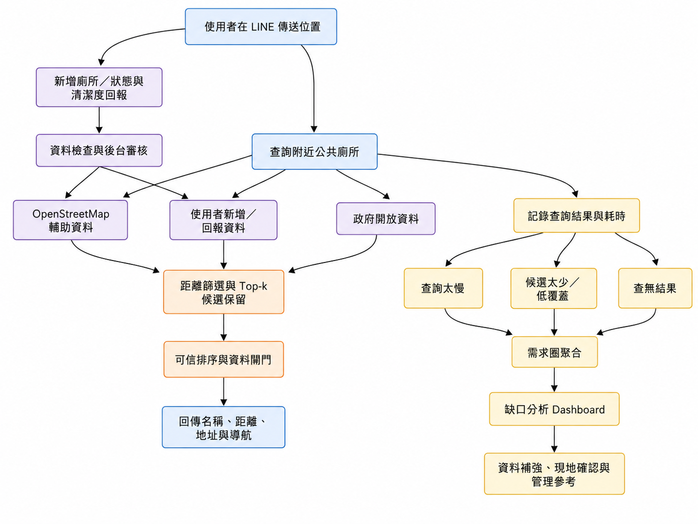

# Toilet Bot｜用 LINE 找廁所，也找出哪裡的資料還不夠

人在外面急著找廁所時，通常不想下載新的 App，也不想慢慢比較資料，只想趕快知道：**附近哪一間比較適合？位置在哪裡？要怎麼走？**

Toilet Bot 以 LINE 作為入口。使用者只要傳送目前位置，系統就會整合政府開放資料、使用者新增資料與 OpenStreetMap，回傳附近公共廁所的名稱、距離、地址與導航連結。

但這個專案不只停在「幫一個人找到廁所」。如果某些地點經常查不到、結果太少或查詢特別慢，這些紀錄也可能代表當地資料不完整，或值得進一步確認。因此系統會把這些情況整理成需求圈，顯示在缺口分析 Dashboard，作為之後補資料或現場查看的參考。

> 簡單來說：成功的查詢幫助當下使用者；失敗或不理想的查詢，則幫助我們找出下一個需要改善的地方。

## 為什麼做這個專案？

現有的公共廁所資料可能來自政府、地圖平台或使用者回報，各來源的更新時間與完整程度不一定相同。實際使用時常會遇到：

- 附近明明可能有廁所，系統卻查不到。
- 找到的地點距離太遠，或候選結果太少。
- 地圖上有點位，但地址、入口或樓層不清楚。
- 資料顯示可用，到了現場才發現關閉或維修。
- 最近的結果資料不一定最完整，也不一定最可靠。

因此，我們希望同時做好「即時搜尋」與「資料持續改善」兩件事。

## 這套系統主要做三件事

### 1. 讓使用者快速找到附近廁所

不必另外下載 App，直接在 LINE 傳送位置，就能取得附近廁所、距離、地址與導航連結。

### 2. 讓搜尋結果不只看距離

最近不一定最適合。系統會同時考慮距離、資料來源、資訊是否完整、審核狀態及近期使用狀態，避免把明顯不可靠的地點排在前面。

### 3. 把「查不到」變成改善線索

系統會記錄查無結果、候選太少與查詢太慢等情況，再把附近的紀錄合併成需求圈。Dashboard 顯示的是「值得優先檢查的範圍」，不直接代表一定要新建廁所，也可能只是資料漏收、位置不清楚或開放狀態需要確認。

## 專案目標

- 降低使用者在陌生地點尋找公共廁所的時間。
- 不只依距離排序，也考慮資料可信度、資訊完整度及目前狀態。
- 讓使用者補充廁所、回報狀態並提供清潔度回饋。
- 將查無結果、低覆蓋與慢查詢轉為資料改善線索。
- 建立從「搜尋」到「發現問題、審核、修正資料」的完整循環。

## 核心功能

| 使用者／角色 | 功能 |
| --- | --- |
| LINE 使用者 | 傳送位置、搜尋附近廁所、切換一般或 AI 推薦模式、收藏地點 |
| 一般使用者 | 新增廁所、回報設施狀態、填寫清潔度與使用回饋 |
| 系統 | 整合多個資料來源、去除重複地點、進行可信排序並記錄查詢情況 |
| 研究／管理者 | 查看使用儀表板、需求圈、缺口原因與排序表現 |
| 資料維護者 | 審核使用者投稿、重新驗證資料並查看維護摘要 |

## 系統運作方式



這張圖呈現兩條互相連接的流程：左側是使用者新增、狀態與清潔度回報經過檢查及後台審核；中間是多來源資料經距離篩選、Top-k 候選保留及可信排序後回覆使用者；右側則把查詢太慢、低覆蓋與查無結果整理成需求圈和缺口分析 Dashboard。

完整的元件與資料流說明請見 [ARCHITECTURE.md](ARCHITECTURE.md)，逐檔職責請見 [PROJECT_STRUCTURE.md](PROJECT_STRUCTURE.md)。

## 和一般搜尋工具有什麼不同？

| 比較項目 | 一般搜尋工具 | Toilet Bot |
| --- | --- | --- |
| 使用方式 | 網站、地圖或 App | 直接使用 LINE |
| 排序方式 | 多半以距離為主 | 同時考慮距離、可信度、完整度與狀態 |
| 查不到時 | 顯示沒有結果 | 留下紀錄，作為缺口分析線索 |
| 資料補充 | 依賴原始資料來源 | 可由使用者新增、回報，再交由後台審核 |
| 後續分析 | 通常只處理單次搜尋 | 將重複出現的問題整理成需求圈與 Dashboard |

## 排名方式

系統不會只把最近的廁所排在第一名。現行的 NTS（Nearby Toilet Score）會綜合以下資訊：

- 距離分數：60%
- 資料可信度：20%
- 資訊完整度：10%
- 設施狀態：10%

可信度會參考資料來源、人工審核狀態、資料完整度與更新時間。若投稿已被判定為不可信，就不會因為距離近而出現在正常推薦結果中。實作位於 `toilet/scoring.py`。

搜尋時會先用直線距離快速保留附近候選，再進行後續排序。這樣不用對所有資料做複雜計算，也能維持即時回覆速度。

## 使用到的技術

- Web：Flask、Gunicorn
- LINE：LINE Messaging API、LIFF
- 資料庫：PostgreSQL（正式資料）、SQLite（本機快取與部分分析）
- 外部資料：政府公共廁所 CSV、OpenStreetMap Overpass API
- 資料處理：pandas、scikit-learn、joblib
- AI 摘要／推薦：OpenAI API（有設定金鑰時使用）
- 部署：Render 相容的 `Procfile` 與 Python runtime 設定

## 專案目錄

```text
app.py             Flask 組裝入口與路由註冊
config.py          環境變數型設定
core/              資料庫、快取、國際化與共用工具
linebot_app/       LINE webhook、回覆、同意與事件去重
toilet/            搜尋、資料來源、排名、回饋、狀態與投稿
dashboard/         使用分析、缺口分析與 NTS 指標
admin/             管理端審核與維護 API
features/          成就、徽章、使用摘要與 AI 推薦
templates/         LIFF、儀表板與管理頁面
data/              公共廁所資料與本機資料檔
models/            清潔度模型與編碼器
lang/              中英文文字資源
scripts/           資料回填等維運腳本
```

## 本機啟動

需求：Python 3.11、可用的 LINE Messaging API channel；需要完整資料功能時另需 PostgreSQL。

```powershell
python -m venv .venv
.\.venv\Scripts\Activate.ps1
pip install -r requirements.txt
Copy-Item .env.example .env
python app.py
```

將 `.env` 中的必要設定補齊：

| 變數 | 用途 |
| --- | --- |
| `LINE_CHANNEL_ACCESS_TOKEN` | 呼叫 LINE Messaging API |
| `LINE_CHANNEL_SECRET` | 驗證 LINE webhook 簽章 |
| `DATABASE_URL` | PostgreSQL 連線字串 |
| `PUBLIC_URL` | 部署後的公開網址 |
| `CONSENT_PAGE_URL` | 使用者同意頁網址 |
| `LIFF_STATUS_ID` | 狀態回報 LIFF ID |
| `ADMIN_TOKEN` | 管理功能驗證 |
| `CONTACT_EMAIL` | 外部資料查詢的聯絡資訊 |

其他效能與防重設定已列在 `.env.example`。請勿提交 `.env`、服務帳號或其他憑證。

## 主要入口

| 路徑 | 說明 |
| --- | --- |
| `/callback` | LINE webhook |
| `/nearby_toilets` | 附近廁所查詢 API |
| `/consent`、`/privacy` | 同意與隱私頁面 |
| `/status_liff` | 廁所狀態回報介面 |
| `/dashboard` | 主要分析儀表板 |
| `/dashboard/gap` | 公共廁所服務缺口分析 |
| `/dashboard/nts` | NTS 與資料來源指標 |
| `/dashboard/maintenance` | 使用者投稿審核與維護 |
| `/healthz`、`/readyz` | 服務健康與就緒檢查 |

## 使用限制

專案已有模組化與基本編譯檢查紀錄，詳見 [VERIFICATION_REPORT.md](VERIFICATION_REPORT.md)。

需求圈代表「值得檢查的位置範圍」，不等於該處一定缺少廁所，也不代表一定需要新建設施。實際情況仍需搭配現場狀態、開放時間、周邊設施與管理單位判斷。

另外，搜尋結果仍可能受到外部 API、資料更新速度及使用者回報品質影響，因此推薦結果應視為協助判斷的資訊，而不是設施當下可用的絕對保證。
